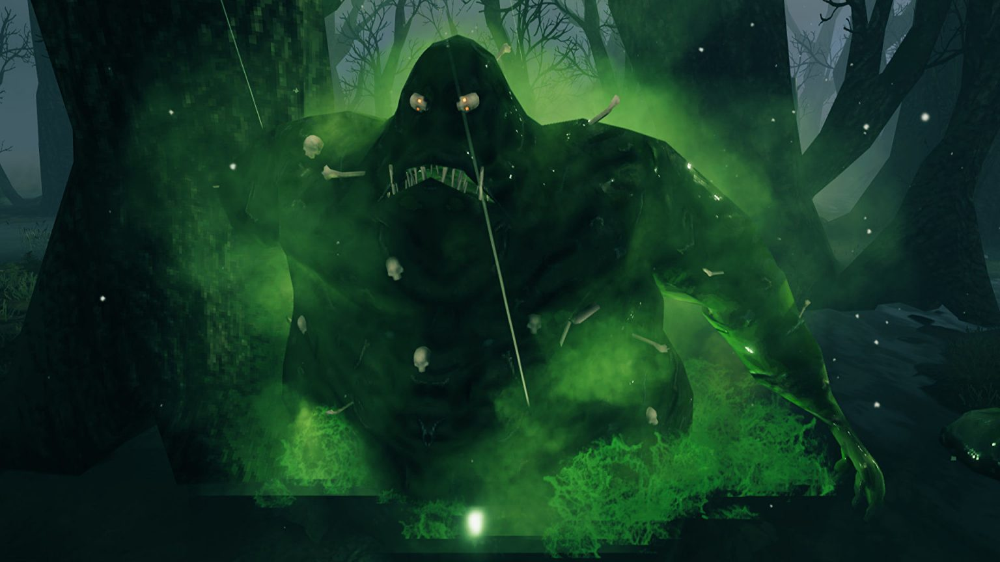
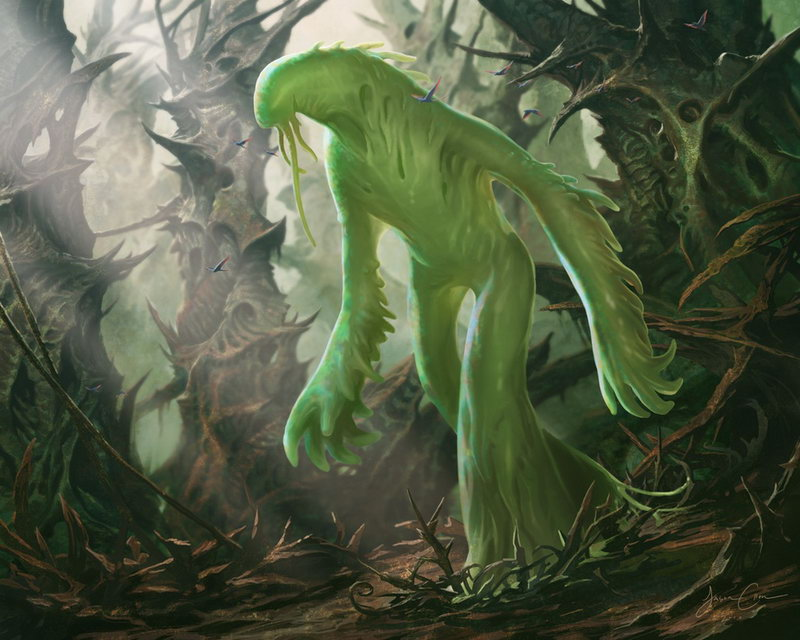

# Пожирающий плоть

## Внешность

Первая фаза - Выглядит как 4-5 метровая, относительно бесформенная масса из костей, сгнившей плоти, предметов и какого-то зелёного магического связующего вещества. 

Вторая фаза - Это дух которой может вселяться в живые существ и брать их тела, но не разум под контроль. Жертва всё чувствует и понимает и испытывает адскую боль. Может брать мёртвые тела под контроль и соединять их в одного голема. Выглядит как бесплотный дух зелёного цвета. 

## 